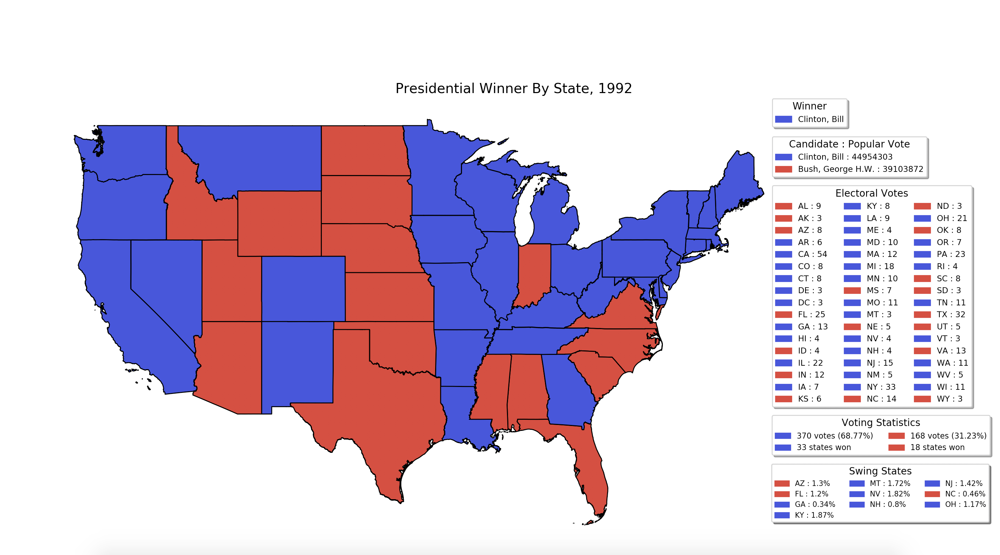
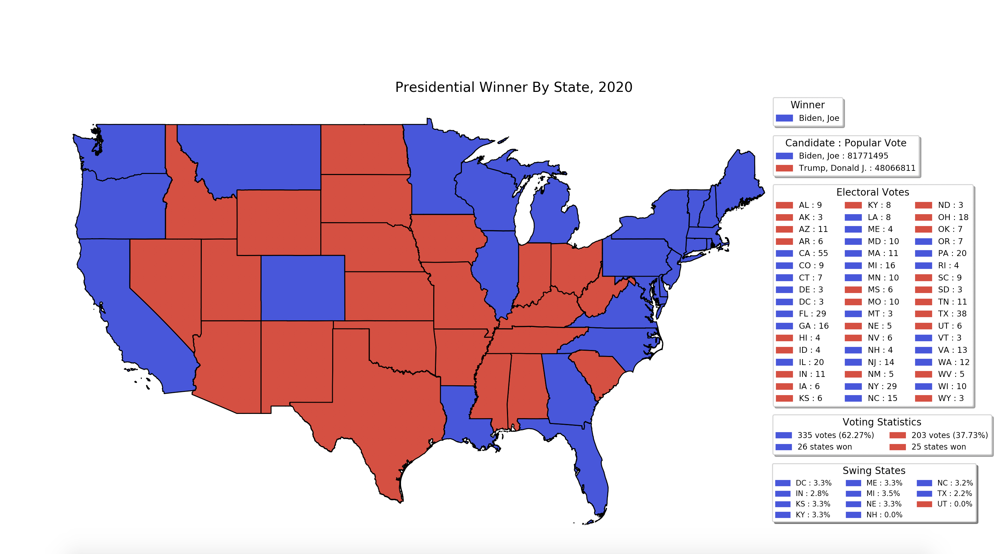

Accomplishes two things:

1) Plots historic presidential election data based on input election year
   > python main_program.py --in <'year'>
   
2) Attempts to predict and subsequently plot 2020 Presidential election results
   > python main_program.py
   
